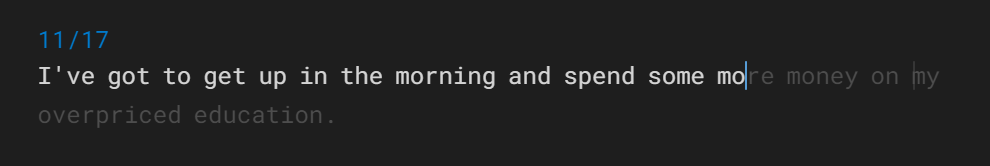

<!--    -->
  
  

    
  

  <h1>
    hey there 👋
  </h1>

### ✨ About me ✨:  
- Aspiring software developer and full-stack developer 👨‍💻
- Studying computer science @ Monash University, Melbourne 📘
-  Passionate in teaching and educating others in all things tech and programming 👨‍🏫
- Always learning 🤓

---

### 📏 Tools and Languages 📐:  

  
  
  
  
  
  
  
  
  
        
  

---

  

<!--
**Rikidink/Rikidink** is a ✨ _special_ ✨ repository because its `README.md` (this file) appears on your GitHub profile.

Here are some ideas to get you started:

- 🔭 I’m currently working on ...
- 🌱 I’m currently learning ...
- 👯 I’m looking to collaborate on ...
- 🤔 I’m looking for help with ...
- 💬 Ask me about ...
- 📫 How to reach me: ...
- 😄 Pronouns: ...
- ⚡ Fun fact: ...
-->
